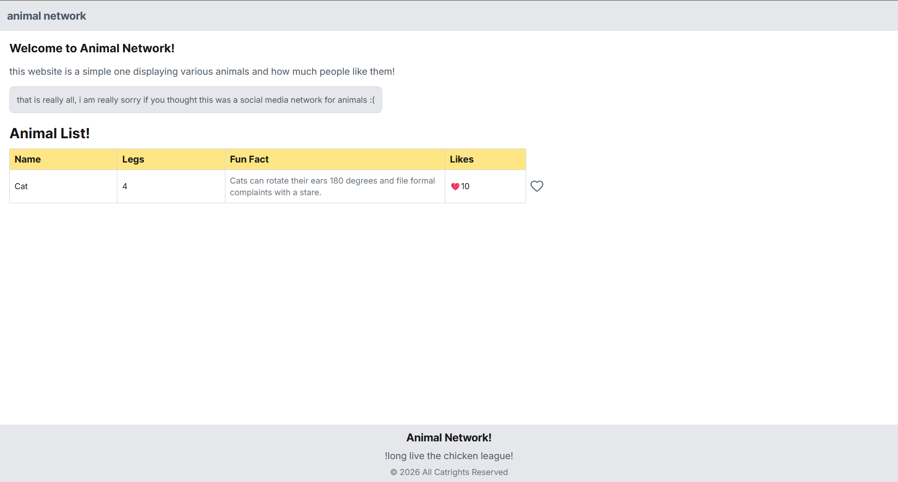

# Animal Network

## About

This is a simple and easy to use animal network website! It was just made as an example for testing out full-stack development. pew pew!

## Structure

* `/frontend` - the front-end facing website!
* `/backend` - the back-end guts and systems!

## Gallery

> Home Page

## Technical Implementation

### Frontend

> Animal Network (frontend) was built using the tech stack below

#### Core (Frontend)

* React
* Next.js
* Tailwind CSS
* Tanstack Query

#### Misc (Frontend)

* Lucide React Icons
* Prettier
* ESLint

---

### Backend

> Animal Network (backend) was built using the tech stack below

#### Core (Backend)

* Node.js
* TypeScript
* Hono
* Prisma ORM
* PostgreSQL
* Docker

#### Misc (Backend)

* Zod
* Prettier
* ESLint

More information about the backend in its [README](./backend/README.md)!

## Notice

You can fork or download the source!

## License

[MIT](./LICENSE)
